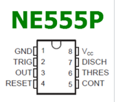
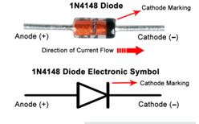
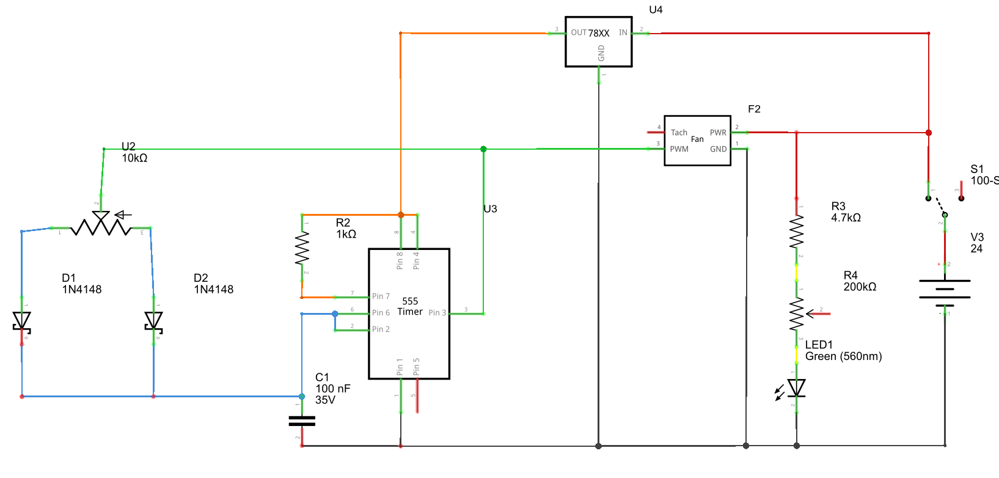

# Soldering fume extractor

## Description and operation instructions
Fumes which might be hazzourdus may be released during soldering. I therefor created a modular fume suction box. It can be used with active carbon, Hepa or any other filters.
The fan can be controlled via a potentiometer. Use a 24V, 2A power adapter. Turn the fan on via the switch. A green LED will turn on.

 ## Technical description
A 120mm 24V PC fan is used where the RPM is controlled via the PWM signal. A 555 generates the PWM signal. The PWM signal may not exceed 5V as it will damage the fan. The tacho of the fan is not used.
A more filters to the box, but keep in mind that by every filter the suction of the air will be reduced. The 555 will generate a 1kHz signal. This is not optimal as Noctua describes to use a 25kHz signal, but works fine.

PWM info: https://circuitdigest.com/fullimage?i=circuitdiagram/PWM-generation-using-555-timer-IC-circuit-diagram.png

### Parts
1 x Noctua NF-F12 industrialPPC-24V-3000 SP IP67
PLA filament
3 x 2-12mm screw
2 x 2,6-8mmm srew
4 x 85mm M4 bolt
4 x M4 cnut
Some wires

1 x 24V PWM fan

1 x 555

2 x 1N4148 Diode

1 x 5,5 x 2,1 mm DC power plug

1 x 10k Potentiometer
1 x 1k Resistor
1 x 100nF ceramic capacitor
1 x 7805 Voltage regulator
1 x switch
1 x 4k7 resistor
1 x 200k potentiometer
1 x 3mm green LED 

### Schematic overview

 

## 3D print parts
00 Soldering fan 01.3mf - contains all parts
Print in PLA and use support for the following prints
- Fan holder 05
- Electronics box

### Mounting the fan
Guide the fan cable around the fan and position it into the 3D printed fan holder 

